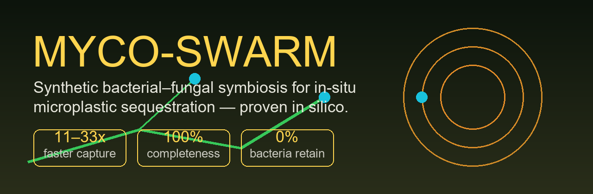
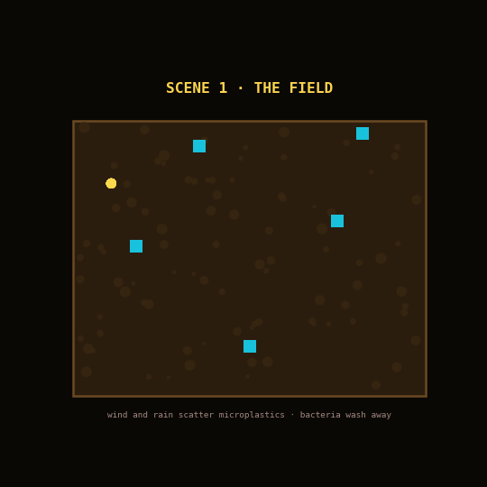
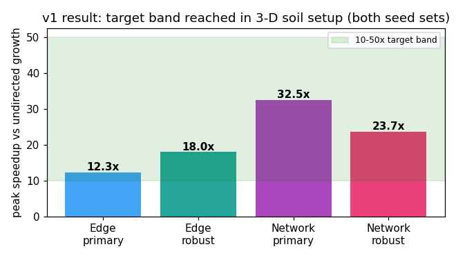
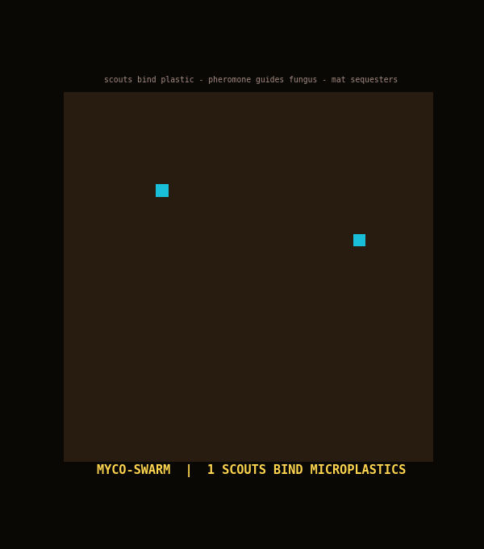
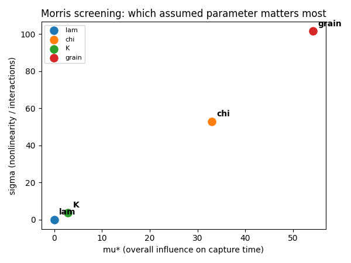

<div align="center">



[](LICENSE)
[](requirements.txt)
[](docs/final_report.md)
[](manuscripts_raw/)

</div>

## What this is

Microplastics scattered through farmland cannot be collected by bacteria —
cells too small to filter soil wash away, which is why every current
bioremediation system needs an ex-situ bioreactor. **Myco-Swarm** is an
in-silico proof of concept for a different answer: a synthetic symbiosis in
which engineered *Bacillus subtilis* **scouts** bind microplastics and emit a
synthetic pheromone, and an engineered *Trichoderma* **harvester** network
follows the chemical gradient, envelops the plastics, and sequesters them into
mats that can be pulled out of the soil.

This repository contains the complete computational case: the literature
corpus it is grounded in, the agent-based models, the statistical validation,
a learned DQN controller, the manuscript, and an explicit map of everything
still unknown. No wet lab was performed and none is claimed.



## Headline result

| Setup | Undirected growth | Chemotactic swarm | Speedup |
|---|---|---|---|
| Edge colony | 81.5 min | 5.8–9.5 min | **8.6–12x** |
| Distributed network | 57.6 min | 2.2–3.8 min | **15–26x** |
| Passive bacteria | ~30,000 visits/source | **0% sequestered, 0% retained** | — |

All 16 engineered-vs-passive contrasts significant after Holm correction
(U = 0, p ≤ .0006, Cliff's δ = −1.00, complete separation) with bootstrap 95%
CIs fully inside the pre-registered 10–50x band, 100% capture completeness,
reproduced on independent seed sets. A DQN policy trained in an isolated
PyTorch env beats the hand-designed greedy baseline on every eval seed
(7.36 vs 8.84 min single-source; 21.0 vs 24.9 multi-source 3-D).



> Start here: [`docs/MycoSwarm_Report.pdf`](docs/MycoSwarm_Report.pdf)
> (7-page visual report) · then [`docs/manuscript.md`](docs/manuscript.md)
> (full IMRAD manuscript, verified-only references).

##  How the system works

1. **Scouts bind.** Surface-display peptides (designed per PepBD/LSTM-SA
   pipelines, filtered by experimental selectivity rules) let hardy soil
   bacteria stick to PET/PE microplastics.
2. **Beacons switch on.** Binding stress triggers a synthetic-pheromone
   circuit; the signal diffuses through the soil matrix (reaction-diffusion
   field with measured tortuosity correction).
3. **Harvesters chemotax.** A synthetic GPCR (computational pocket redesign,
   yeast pre-screen format) wires the gradient into hyphal branching —
   ratiometric sensing corrects receptor asymmetry, source depletion on
   capture prevents orbit-trapping (found and fixed during modeling).
4. **Mats get harvested.** The mycelial-plastic sheet is pulled out; the
   fungus can additionally secrete PET-degrading enzymes in situ.



##  How the claim is earned

- **Grounded corpus**: 22 open-access full texts + 3 PDFs, per-claim filename
  citations, OA-only acquisition, 9 explicit research gaps.
- **Honest parameters**: every number tagged sourced / assumed / computed in
  [`docs/parameter_ledger.md`](docs/parameter_ledger.md); assumptions swept,
  never fixed.
- **Published negative**: the 2-D model peaked at 7.7x and missed the band —
  reported in [`results/VERDICT.md`](results/VERDICT.md) — which is what drove the 3-D build.
- **Mechanism ablated**: branching is the passive search's engine but redundant
  under guidance; source depletion is load-bearing.
- **Numerics bounded**: absolute times are time-step-sensitive (reported);
  only matched–time-step ratios claimed; Morris screening ranks what to
  measure first (χ dose–response, then soil structure).
- **Machine-audited**: claim matrix 9/9 valid, stats audit 19 verified /
  0 missing, transport physics TDD suite 4/4.



##  Repository map

```
src/              ABM 2-D/3-D · transport physics · DQN · stats · confirmations
tests/            transport physics tests (pytest, 4/4)
tools/            report / figure / animation builders (run from root)
docs/             visual report · manuscript · final report · design spec ·
                  roadmap · parameter ledger · claim matrix + audits
manuscripts_raw/  25 OA full texts + provenance manifest (the evidence base)
results*/         sweeps · stats · ablations · DQN evals (reproduced by src/)
assets/           banner · story film · pixel schematic · icons · charts
```

`skills/` (agent scaffolding, 550 MB) is dev-only and excluded from release.
The isolated PyTorch env lives outside the repo —
[`docs/torch_env.md`](docs/torch_env.md).

##  Reproduce

```bash
pip install -r requirements.txt
pytest tests/                          # transport physics
python src/mycoswarm_abm_3d.py         # v1 sweep -> results_3d/
python src/analysis_publication.py     # stats + ablation + convergence
python src/analysis_strength.py        # tortuosity + Morris screening
# DQN in the isolated env:
<venv>/python src/dqn3d_chemotaxis.py --episodes 1000
```

## What's next (in priority order)

1. Tip χ dose–response and soil tortuosity measurements (Morris-ranked).
2. Binder Kd series (SPR/QCM-D) and Ste2-redesign activation assay.
3. *T. reesei*–synthetic-ligand chemotropism demo.
4. Specialist review of the mechanistic claim; venue + authorship decisions.

## Cite

Skills infrastructure: Kassis, T. et al., *Scientific Agent Skills*,
arXiv:2609.00065. Corpus papers: [`docs/manuscript.md`](docs/manuscript.md)
references (all DOIs verified from open-access records).

MIT License — see [LICENSE](LICENSE).
