<div align="center">

# Myco-Swarm

**In-silico proof of concept for synthetic bacterial–fungal symbiosis in microplastic sequestration**

[](LICENSE)
[](requirements.txt)
[](docs/final_report.md)
[](manuscripts_raw/)

*Engineered bacterial scouts bind microplastics and emit a synthetic pheromone;
an engineered fungal network follows the gradient and sequesters the plastics
into harvestable mats.*


</div>

---

##  Result



A chemotactic fungal swarm sequesters scattered sources **11–33x faster than
undirected growth** (3-D soil matrix, 100% completeness; 16/16 contrasts
Holm-significant with bootstrap CIs fully in-band), reproduced on fresh seeds.
A learned DQN controller beats the hand-designed greedy baseline on every eval
seed. Passive bacteria visit ~30,000 times yet sequester **0%**.

Start with [`docs/MycoSwarm_Report.pdf`](docs/MycoSwarm_Report.pdf), then the
full [`docs/manuscript.md`](docs/manuscript.md).

##  How it works

| Stage | Mechanism | Grounded in |
|---|---|---|
| Scouts bind plastic | Surface-display peptides on *B. subtilis* | PepBD/LSTM-SA designs, QCM-D/SPR data |
| Beacons switch on | Synthetic pheromone diffuses (C06 field form) | Measured λα, Hill response |
| Harvesters chemotax | Tips branch up-gradient, deplete on capture | Tip rates, assay geometries |
| Mat harvest | Mycelial-plastic sheet pulled from soil | Sequestration endpoint |


##  Evidence


- **Statistics**: Mann–Whitney U = 0 everywhere, Holm p ≤ .0006, Cliff's δ = −1.00;
  ablation, convergence, Shapiro ×24, Morris screening, TDD transport suite 4/4.
- **Audits**: claim matrix 9/9 valid · stats audit 19 verified / 0 missing.
- **Corpus**: 25 open-access full texts, per-claim filename citations, 9 explicit
  research gaps — nothing extrapolated.

##  Documents

| Document | Contents |
|---|---|
| [`docs/MycoSwarm_Report.pdf`](docs/MycoSwarm_Report.pdf) | 7-page visual report |
| [`docs/manuscript.md`](docs/manuscript.md) | Full IMRAD manuscript, verified-only references |
| [`docs/final_report.md`](docs/final_report.md) | Claim, evidence chain, limits |
| [`docs/design_spec.md`](docs/design_spec.md) | Peptide + GPCR build plans with stop rules |
| [`docs/parameter_ledger.md`](docs/parameter_ledger.md) | Every number: sourced vs assumed vs computed |
| [`docs/roadmap.md`](docs/roadmap.md) | Phase plan and status |

##  Reproduce

```bash
pip install -r requirements.txt
pytest tests/                       # transport physics, 4 tests
python src/mycoswarm_abm_3d.py       # v1 sweep -> results_3d/
python src/analysis_publication.py   # stats + ablation + convergence
# DQN in the isolated env: <venv>/python src/dqn3d_chemotaxis.py --episodes 1000
```

Isolated PyTorch setup: [`docs/torch_env.md`](docs/torch_env.md).
`skills/` (agent scaffolding) is dev-only and excluded from release.

## Cite

Skills infrastructure: Kassis et al., *Scientific Agent Skills*,
arXiv:2609.00065. Corpus papers: manuscript references (DOIs verified from
open-access records).
