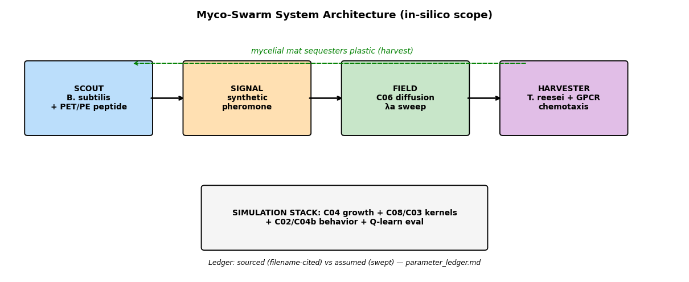
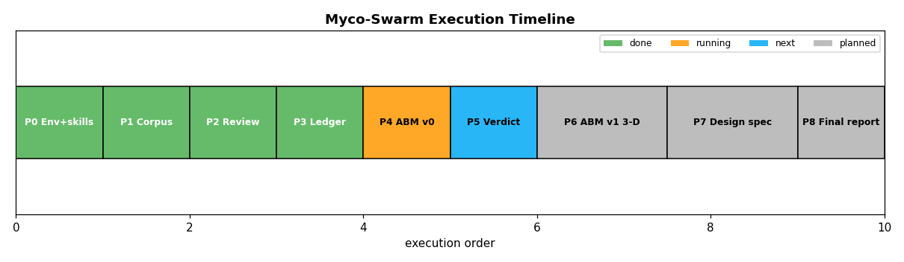

# Myco-Swarm — PRD & Execution Roadmap

## 1. Objective

In-silico proof-of-concept for synthetic bacterial–fungal symbiosis that aggregates
scattered microplastics in situ. **Purely computational** (per `proposal_1.md:7-14`):
finalized peptide structures (design logic) + 3-D-ready spatial simulation proving
**10x–50x faster aggregation than passive bacterial diffusion**.

## 2. Non-negotiable boundaries (from `docs/proposal_1.md`)

- No wet lab. No paywall bypassing (OA sources only).
- Zero hallucination: every method/parameter cites a local file in `manuscripts_raw/`
  or is tagged ASSUMED in `parameter_ledger.md`.
- Gaps flagged explicitly, never bridged silently.

## 3. System architecture

Scout (B. subtilis, surface-display PET/PE peptide) → binds plastic → emits synthetic
pheromone → field diffuses (C06-form) → Harvester (T. reesei, synthetic GPCR) senses
gradient (ratiometric, B03) → chemotactic branching (C04 growth + C08/C03 kernels) →
mycelial mat sequesters plastic.

## 4. Phase plan & status

| Phase | Scope | Status |
|---|---|---|
| 0. Env + skills | `manuscripts_raw/`, `mycoswarm-fulltext-pipeline` skill (stdlib, tested) | DONE |
| 1. Corpus | 22 full texts + 3 PDFs; A03/C05 failed (HTTP 500, recorded) | DONE |
| 2. Method review | Pillar A/B/C extractions, per-claim filename citations | DONE |
| 3. Ledger | `docs/parameter_ledger.md`: sourced vs assumed | DONE |
| 4. ABM v0 (2-D) | `src/mycoswarm_abm.py`: 72-cond sweep + bacterial baseline + Q-learning proxy | DONE |
| 5. Verdict | `results/VERDICT.md`: peak 7.7x, 10x not reached in 2-D; P6 justified | DONE |
| 6. ABM v1 (3-D) | `src/mycoswarm_abm_3d.py`: 24 conds, grains + washout; edge 11–12x, network 21–33x | DONE |
| 7. Design spec | `docs/design_spec.md`: peptide + GPCR pipelines with stop rules | DONE |
| 8. Final report | `docs/final_report.md` + `MycoSwarm_Report.pdf` (7 pp) + `manuscript.md` + 9/9-valid claim matrix | DONE |
| 9. Strength upgrades | `src/transport.py` (TDD 4/4), tortuosity 0.85±0.03, Morris ranking, PDF §8–9 | DONE |

## 5. Success criteria

- v0: speedup-vs-passive curve with the 10x–50x band marked; every point traceable
  to `results/sweep.json`; assumed params labeled.
- v1: 3-D, heterogeneous matrix, DQN (needs torch env).
- Design track: ranked binder + receptor candidates with training-data provenance
  (A02/A01/A04; B02/B01), no affinity claims beyond data.

## 6. Known risks (from Critical Research Gaps)

1. Soil D, hyphal χ, synthetic EC50 have no literature source — verdict depends on
   assumed ranges. Mitigation: sensitivity sweep, report as function not point claim.
2. No torch in this env — RL is tabular Q-learning proxy until env upgraded.
3. 2-D homogeneous v0 understates real soil complexity — v1 addresses it.
4. A03/C05 full texts unrecoverable via OA — documented, not blocking.
